# 컴퓨터에게 명령 내리는 말(파이썬) 처음 배우기

## 미션 소개

이 미션에서는 터미널에서 동작하는 나만의 퀴즈 게임을 구현합니다.
Python 문법을 사용해 입출력 흐름을 만들고, 클래스로 역할을 구조화합니다.
또한 JSON 파일을 활용하여 프로그램을 종료해도 점수 데이터가 유지되는 데이터 영속성을 경험합니다.
기능별로 Git 브랜치를 나누어 작업하고, 완성된 기능을 병합하여 변경 이력을 관리합니다.

## 퀴즈 주제 선정과 이유
현재 AI 관련 교육과 프로젝트를 진행하며 AI 기술을 학습하고 있고 학습한 내용을 퀴즈 형식으로 복습하고 AI에 대한 이해를 높이기 위해 AI를 주제로 선정했습니다.

## 개발 환경

| 항목 | 내용 |
|------|------|
| OS | macOS |
| Language | Python 3.x |
| IDE | PyCharm |
| Version Control | Git, GitHub |
| Git Version | git version 2.39.5 (Apple Git-154) |
| Shell | Bash |
| Terminal | PyCharm Terminal |
| Data Format | JSON |

### 개발환경 스크린샷
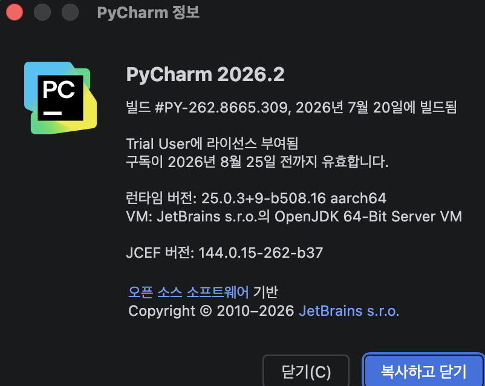
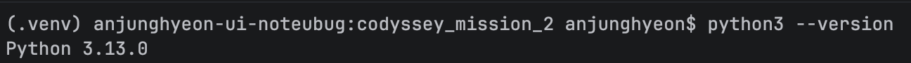
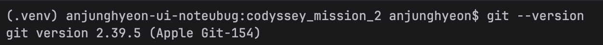
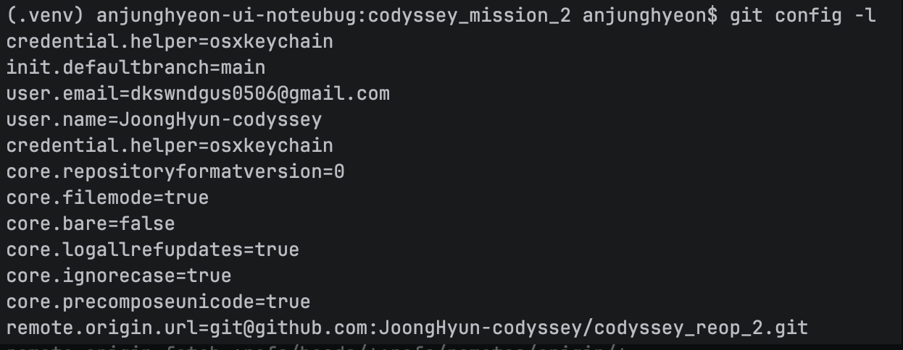


## 수행 체크 리스트

- [v] 프로젝트 초기 구조 생성
- [v] 터미널 메뉴 기본 구조 작성
- [v] `Quiz`, `QuizGame` 클래스 초기 설정
- [v] 퀴즈 등록 기능 구현
- [v] 퀴즈 목록 조회 기능 구현
- [v] 퀴즈 출제 및 정답 확인 기능 구현
- [v] 점수 계산 기능 구현
- [v] JSON 점수 저장 및 불러오기 구현
- [v] 잘못된 사용자 입력 예외 처리
- [v] 전체 기능 실행 확인

## 주요 기능

- 터미널 메뉴를 통한 기능 선택
- 새로운 퀴즈와 정답 등록
- 등록된 퀴즈 목록 확인
- 퀴즈 출제 및 정답 확인
- 정답 점수 확인
- JSON 파일을 이용한 점수 저장 및 불러오기

## 클래스 역할

### `Quiz`

퀴즈 한 문제의 질문과 정답을 저장합니다.

### `QuizGame`

여러 개의 퀴즈와 점수를 관리하고, 퀴즈 메뉴 출력·등록·목록·출제 기능을 제공합니다.

### `main.py`

프로그램을 실행합니다.

## 프로젝트 구조

```text
codyssey_mission_2/
├── images
│   └── after_clone.png
│   └── before_clone.png
│   └── ...
│   └── (기타 실습 이미지)
├── main.py         # 프로그램 실행
├── quiz.py         # Quiz 클래스
├── quiz_game.py    # QuizGame 클래스
└── state.json      # 최고 점수 저장 및 퀴즈 저장 데이터 파일
└── README.md       # 프로젝트 설명
```

codyssey_mission_2/state.json
```json
{
  "best_score" : 10,
  "quiz_list": [],
  "modern_quiz_list" : [{
    "id" : 0,
    "question" : "json",
    "choices" : [
      "choice_1",
      "choice_2",
      "choice_3",
      "choice_4"
    ],
    "answer" : 1
  }]
}

```

## 실행 방법

프로젝트 폴더에서 다음 명령어를 실행합니다.

```bash
python3 main.py
```

## 브랜치 계획

- `feature/menu`: 메뉴 출력 및 선택 기능
- `feature/quiz`: 퀴즈 등록·목록·출제 기능
- `feature/json-storage`: JSON 점수 저장 및 불러오기

# 주요기능

## 퀴즈 메뉴 화면
사용자는 5가지의 메뉴를 이용할 수 있습니다.
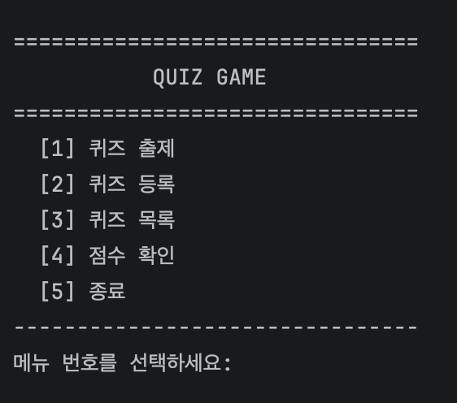

## 퀴즈 풀이
사용자가 등록한 퀴즈가 없다면 기본으로 제공하는 퀴즈를 객관식으로 풀 수 있으며 정답/오답 여부를 알 수 있습니다.
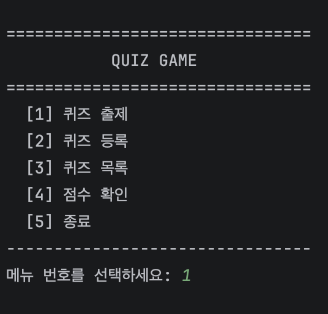
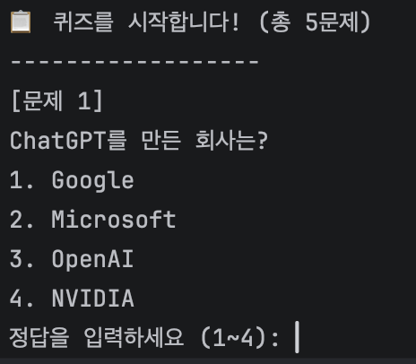

## 퀴즈 정답 및 오답
### 정답
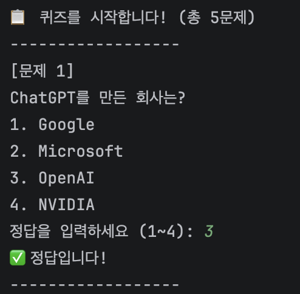
### 오답
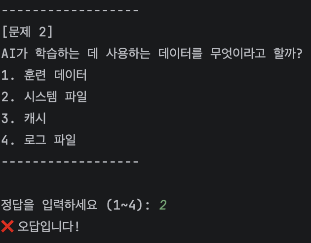

## 결과 화면
사용자가 모든 문제를 풀었다면 얼마나 많은 문제를 풀었는지, 최고 점수를 달성했는지 확인할 수 있습니다.
### 최고 점수를 달성했을때
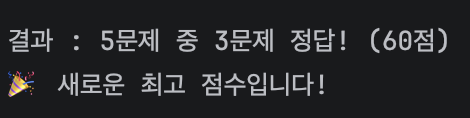
### 최고 점수를 달성하지 못했을때
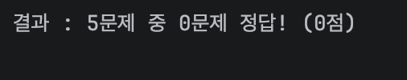

## 퀴즈 등록
사용자는 기본 문제가 아닌 사용자가 퀴즈를 등록하여 문제를 풀 수 있습니다.
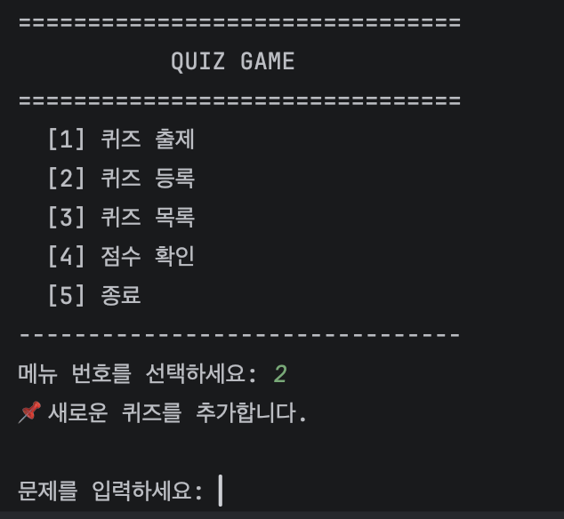
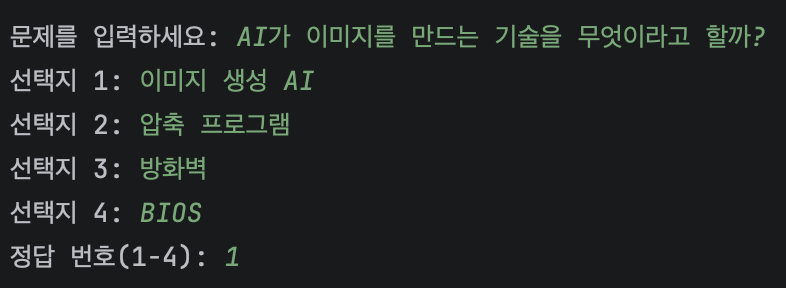

## 결과화면
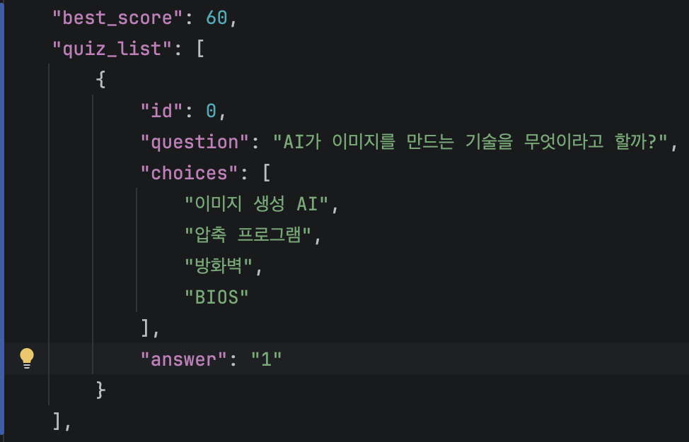

## 퀴즈 목록 확인
사용자가 문제를 등록하지 않았을 시 5개의 기본 문제가 출제되며 문제 등록 이후부터 사용자 문제 리스트를 사용합니다.
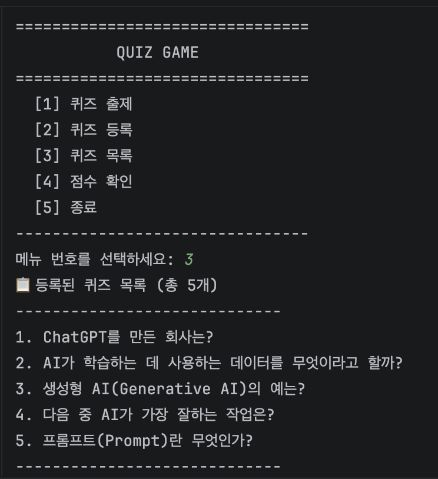
## 결과화면
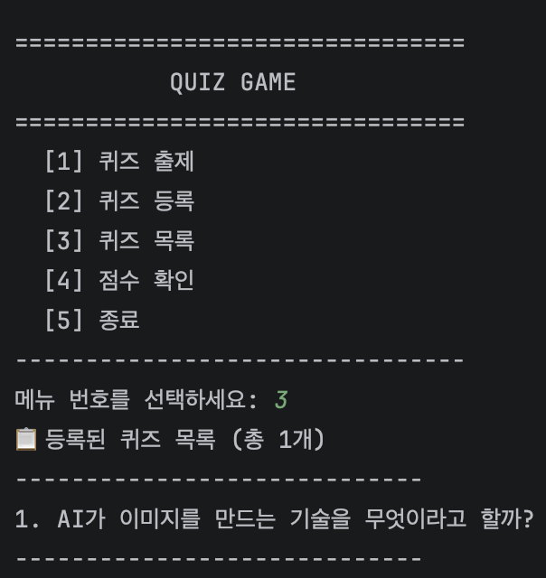

## 점수 확인
사용자는 현재 자신의 최고 점수를 확인할 수 있다.
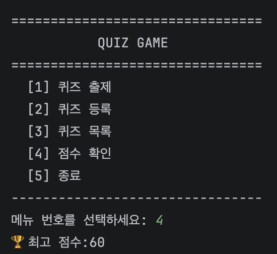

## 퀴즈 종료
사용자가 프로그램의 사용을 마치는 결과이다.
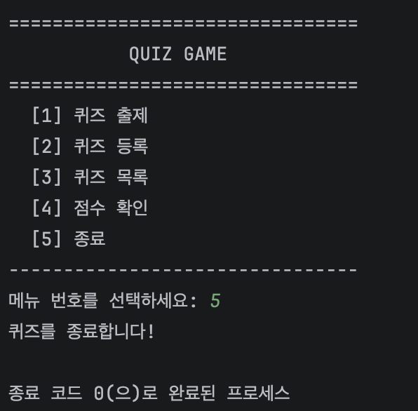

## 예외처리
사용자가 허용되지 않은 값이나 메뉴 번호를 입력했을때 프로그램이 종료되지 않게 예외처리를 적용했습니다.
또한 KeyboardInterrupt를 사용하여 Ctrl+C 입력으로 프로그램이 즉시 종료되지 않게 구현했습니다.
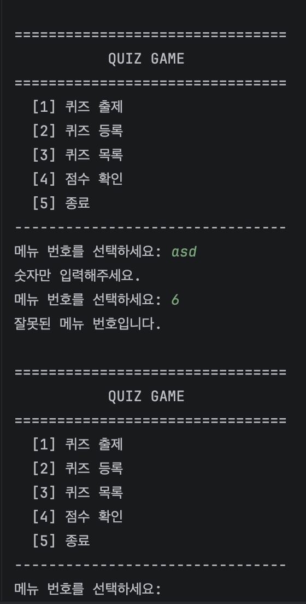
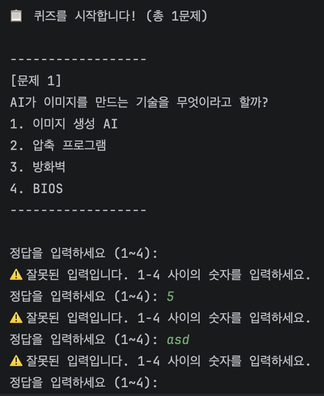
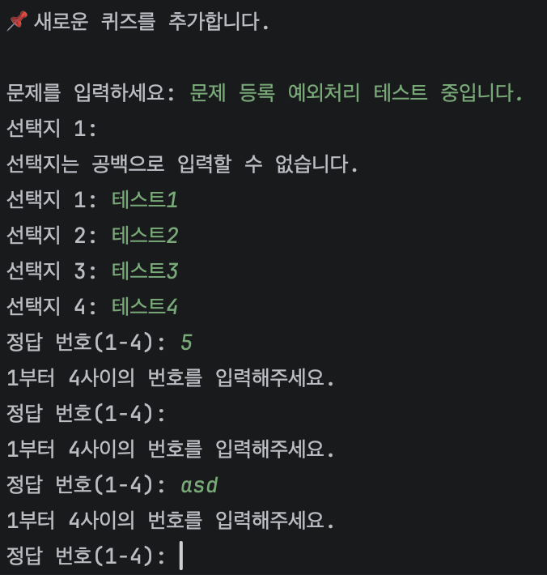
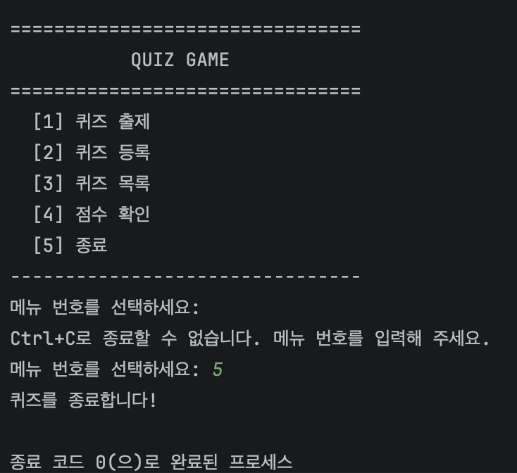

## Git clone 실습
원격 저장소를 로컬 환경으로 복제하는 git clone 명령어를 실습했습니다.
저장소를 복제한 후 파일을 수정하고 커밋 및 푸시를 진행하여 원격 저장소와 동기화되는 과정을 확인했습니다.


## clone 결과화면


## clone후 파일 수정 후 원격 저장소에 push까지


## 결과화면


## Git log 스크린샷


## 트러블슈팅

### 1. 최고 점수 저장 시 퀴즈 데이터가 사라지는 문제

#### 증상
퀴즈를 실행하여 최고 점수를 저장한 뒤 `state.json`을 확인했더니 `quiz_list`와 `modern_quiz_list`가 사라지고 `best_score`만 남았습니다.

#### 원인
`save_best_score()`에서 기존 JSON 데이터를 읽지 않고 `mode="w"`로 새로운 딕셔너리만 저장했습니다.

```python
with open("state.json", mode="w", encoding="utf-8") as file:
```

`mode="w"`는 기존 파일 내용을 모두 삭제한 뒤 새 내용을 작성하기 때문에 기존 퀴즈 데이터가 함께 삭제되었습니다.

#### 해결
기존 `state.json` 데이터를 먼저 읽어온 뒤 `best_score`만 수정하여 다시 저장하도록 변경했습니다.

---

### 2. 새로 등록한 퀴즈의 ID가 5부터 시작하는 문제

#### 증상
사용자 퀴즈를 처음 등록했는데 ID가 `0`이 아닌 `5`부터 생성되었습니다.

#### 원인
`load_quiz_list()`가 `quiz_list`가 비어 있을 경우 기본 퀴즈(`modern_quiz_list`)를 반환하도록 구현되어 있었습니다.

```python
data.get("quiz_list") or data.get("modern_quiz_list", [])
```

이후 ID를 다음과 같이 생성하면서 기본 퀴즈 개수인 `5`가 그대로 사용되었습니다.

```python
id = len(self.load_quiz_list())
```

#### 해결
사용자 퀴즈의 ID는 `modern_quiz_list`와 분리하여 실제 `quiz_list`의 개수만 기준으로 생성하도록 수정했습니다.

```python
def get_new_quiz_id(self):
    try:
        with open("state.json", "r", encoding="utf-8") as file:
            data = json.load(file)
    except (FileNotFoundError, json.JSONDecodeError):
        return 0

    return len(data.get("quiz_list", []))
```